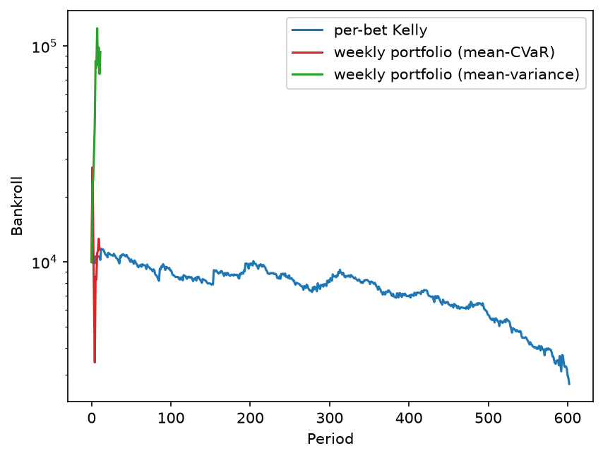

One week, one portfolio decision
=================================

``examples/cfb_weekly_portfolio.py`` replays the 2017 college-football season of
:doc:`cfb` two ways over identical inputs -- same committed fixture, same week
batching, same Glicko ratings, same warm-up and bankroll -- so the two engines can
be compared directly:

* **per-bet Kelly** sizes each game individually through the per-bet engine
  (:class:`keeks_elote.backtest.Backtest`), the ``cfb.py`` path;
* **weekly portfolio (mean-variance)** and **weekly portfolio (mean-CVaR)** size
  each week's slate of winner-side bets jointly through
  :class:`keeks_elote.portfolio_backtest.WeeklyPortfolioBacktest`, one joint-return
  model (:class:`keeks.allocation.BinaryBetsModel`) and one allocator decision per
  week -- the moment-based and scenario-based allocators from keeks' allocation
  layer.

Each arm gets a fresh arena and bankroll so the runs cannot influence one another.
The script prints one summary row per arm -- final bankroll, total return, growth
per week, and maximum drawdown -- and renders the bankroll paths:

         The per-bet Kelly path (blue) grinds down from its 10,000 start to about
         2,700 over the season's roughly 600 settled bets. The two weekly-portfolio
         arms move almost entirely in their first settled weeks: the mean-variance
         arm (green) spikes to about 100,000 before flattening, and the mean-CVaR
         arm (red) spikes to about 16,000, falls to about 4,000, and flattens --
         their weekly settlements compress into the left edge of the per-bet axis.
   :width: 100%

   Bankroll paths for the three arms. The horizontal axis is the per-bet run's
   settled-bet count; the portfolio arms settle once per week, so their eleven
   weekly points sit at the left edge.

The season summary on this fixture (seeds ``42`` and ``1337``, 11 weeks settled,
from a 10,000 bankroll):

==================================  ===============  =============  ===========  =============
Arm                                 Final bankroll   Total return   Growth/wk    Max drawdown
==================================  ===============  =============  ===========  =============
per-bet Kelly                       2,720.86         -72.8%         -0.216%      76.4%
weekly portfolio (mean-variance)    93,996.51        +840.0%        +22.593%     38.6%
weekly portfolio (mean-CVaR)        11,394.96        +13.9%         +1.314%      87.5%
==================================  ===============  =============  ===========  =============

Read the table as a property of the model, not of the market: these are simulated
settlements of one season under one probability model, and the ordering of the
arms is not stable across fixtures or seeds. What the example demonstrates is the
mechanics -- the same weeks, priced two ways, with the ledger and the chart making
the comparison auditable.

.. warning::

   Simulated results from a model, not a forecast and not investment advice.

Reproducing it
--------------

From a checkout of the repository, with the development environment installed
(``uv pip install -e ".[dev]"``):

.. code-block:: bash

   cd examples && ../.venv/bin/python cfb_weekly_portfolio.py

The run is seeded, so it replays deterministically, and it rewrites
``examples/output/cfb_weekly_portfolio.png`` in place -- the chart embedded above.